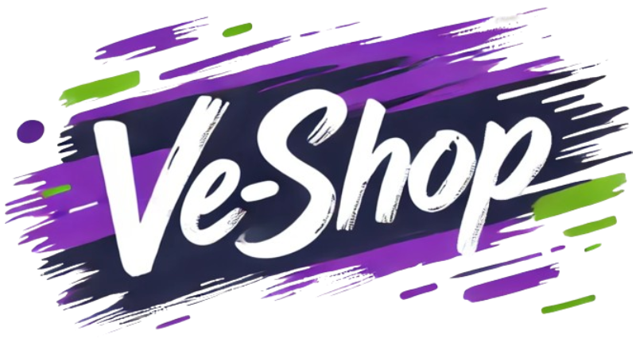

متجر VE-Shop

  <h1>متجر VE-Shop</h1> 
 منصة تجارة إلكترونية حديثة ومتكاملة تم تطويرها باستخدام Next.js، Redux، TailwindCSS وFirebase لتقديم تجربة تسوق سهلة ومميزة للمستخدمين. 
 <h4> <a href="https://ve-shop.co/">مشاهدة العرض التجريبي</a>  ·  <a href="https://github.com/ask-ar/ve-shop/issues">الإبلاغ عن مشكلة</a>  ·  <a href="https://github.com/ask-ar/ve-shop/issues">طلب ميزة جديدة</a> </h4> 
   <!-- محتويات الصفحة -->
:notebook_with_decorative_cover: الفهرس
:notebook_with_decorative_cover: الفهرس
:star2: حول المشروع
:space_invader: التقنيات المستخدمة
:dart: المميزات
:warning: الرخصة
:handshake: التواصل
<!-- حول المشروع -->
:star2: حول المشروع

  

متجر VE-Shop
متجر VE-Shop هو متجر إلكتروني متكامل يتيح للعملاء استعراض المنتجات، إضافتها إلى سلة التسوق، وتنفيذ عمليات الشراء بسهولة. تم تصميم المنصة بواجهة مستخدم سلسة وتفاعلية لضمان تجربة تسوق مريحة للمستخدمين. يدعم المتجر عدة أقسام مثل الملابس، الإلكترونيات، الأدوات المنزلية، ومستحضرات التجميل، مما يجعله وجهة مثالية للتسوق الشامل.
a
:space_invader: التقنيات المستخدمة

 
التقنيات الخاصة بالواجهة الأمامية
 <ul> <li><a href="https://javascript.info/js">Javascript</a></li> <li><a href="https://nextjs.org/">Next.js</a></li> <li><a href="https://reactjs.org/">React.js</a></li> <li><a href="https://tailwindcss.com/">TailwindCSS</a></li> <li><a href="https://redux.js.org/">Redux</a></li> <li><a href="https://redux-toolkit.js.org/">Redux Toolkit</a></li> <li><a href="https://swiperjs.com/">Swiper.js</a></li> </ul> 
 
 
التقنيات الخاصة بالخادم
 <ul> <li><a href="https://firebase.google.com/">Firebase</a></li> </ul> 
 <!-- المميزات -->
:dart: المميزات
تصميم متجاوب: تجربة تصفح متكاملة على مختلف الأجهزة (الهواتف، الأجهزة اللوحية، الحواسيب).
نظام مصادقة آمن: تسجيل الدخول، تسجيل المستخدمين الجدد، واسترجاع كلمة المرور.
سلة التسوق: إدارة المنتجات في سلة التسوق مع القدرة على تعديل الكميات وحذف العناصر.
عرض تفاصيل المنتج: عرض مواصفات كل منتج، السعر، والصور بجودة عالية.
إمكانية إضافة مراجعات: العملاء يمكنهم ترك تعليقاتهم ومراجعاتهم على المنتجات.
:warning: الرخصة
التوزيع بموجب رخصة مفتوحة المصدر. لمزيد من المعلومات، يرجى الاطلاع على LICENSE.txt.

:handshake: التواصل
الموقع الرسمي: ve-shop.co
